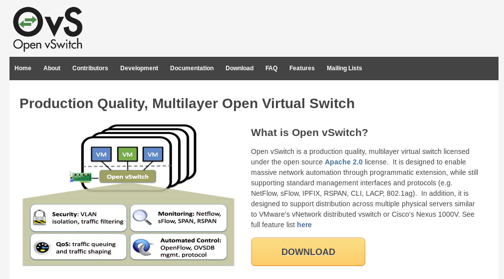
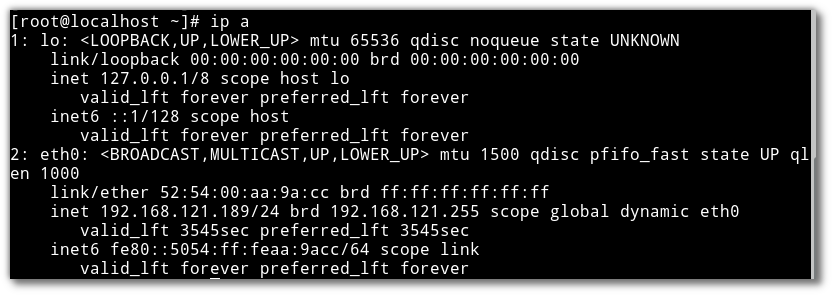
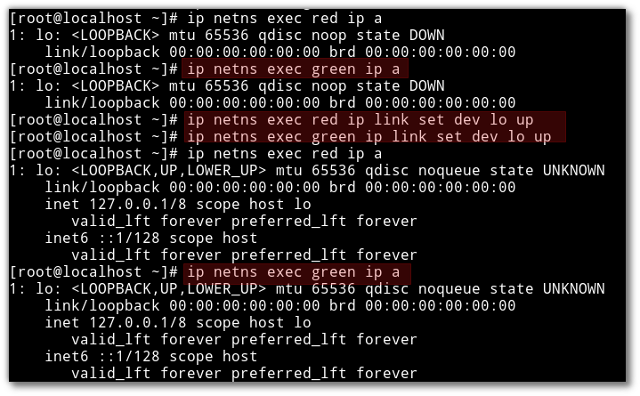
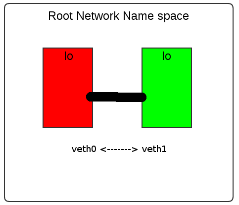
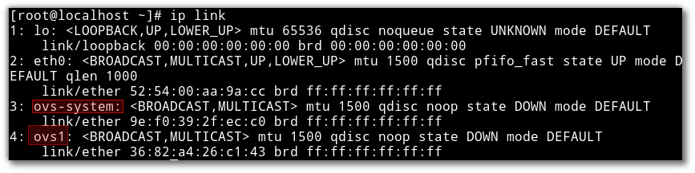
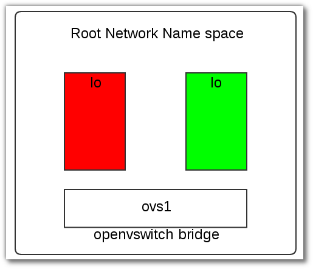
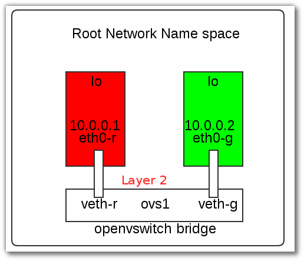

**********************
Linux Network Namespce
**********************

OVS-project
===========
http://openvswitch.org/

Test plan
*********
* ให้สร้าง vagrant file เพื่อสร้าง vm
* ภายใน vm สร้าง 2 network name space ด้วยคำสั่ง  ip
* สร้าง openvswitch bridge และเชื่อม network namespace เข้าหากัน
::

    cd ~
    mkdir ovs
    cd ovs
    vagrant init centos/7
    vagrant up
    vagrant ssh
    sudo su -

    //list ROOT network namespace
    ifup eth0
    dhclient eth0
    ip link
    ip a
    ip r

Command
::

    ip netns add <new namespace name>

สร้าง namespace ชื่อ red, green::

    //create new two network namespaces
    ip netns add red
    ip netns add green

    //list network name space
    ip netns
    --or--
    ls /var/run/netns

    //(ข้าม ขั้นตอนนี้ !!ไม่ต้องทำ) delete network namespace
    ip netns del red
    ip netns del green

.. image:: images/virtdev002.png

::

    //run in network name space
    ip netns exec red ip a
    ip netns exec green ip a

    //up the loopback interfaces (lo) of the namespaces
    ip netns exec red ip link set dev lo up
    ip netns exec green ip link set dev lo up

หลังจากสร้าง namespace การสร้าง interface ให้แก่ แต่ละ namespace

* โดยการสร้าง virtual Ethernet (veth) interfaces

::

    ip link add veth0 type veth peer name veth1
    ip link list

* หลังจากนัั้นก็ assign แต่ละข้างของ veth pair ให้แก่ namespace

::

    ip link set veth0 netns red
    ip link
    (veth0 หายไปอยู่ใน red namespace)
    ip netns red ip link

    ip link set veth1 netns green
    ip link
    (veth1 หายไปอยู่ใน green namespace)

กำหนด ip ให้แก่ veth0
::
    ip netns exec red ip addr add 10.0.0.10/24 dev veth0
    ip netns exec red ip a

    ip netns exec green ip addr add 10.0.0.11/24 dev veth1
    ip netns exec red ip a

    //up the loopback interfaces (lo) of the namespaces
    ip netns exec red ip link set dev veth0 up
    ip netns exec green ip link set dev veth1 up

    //Test ping from red to green
    ip netns exec red /bin/bash
    ping 10.10.10.11
    exit

Create Switch (bridge)
::

    yum install wget
    wget ftp://ftp.muug.mb.ca/mirror/centos/7.2.1511/cloud/x86_64/openstack-kilo/common/openvswitch-2.4.0-1.el7.x86_64.rpm
    yum install openvswitch-2.4.0-1.el7.x86_64.rpm
    systemctl start openvswitch
    systemctl enable openvswitch

    lsmod | grep openv
    openvswitch            84543  0
    libcrc32c              12644  1 openvswitch

    ovs-vsctl add-br ovs1
    ovs-vsctl show
    (result)
    Bridge "ovs1"
        Port "ovs1"
            Interface "ovs1"
                type: internal
    ovs_version: "2.4.0"

    //list in ROOT network namespace
    ip link

การเชื่อมต่อระหว่าง openswitch กับ network name space จะเชื่อมต่อกันด้วย virtual ethernet interface pair
ทำหน้าที่เสมือนท่อระหว่าง openswitch และ network namespace ``eth0-r >--------< veth-r``

.. image:: images/virtdev006.png

::

    //create veth pair ไว้ก่อนแต่ยังไม่ได้เชื่อมกัน
    ip link add eth0-r type veth peer name veth-r
    ip link

    // will see both end of pipe
    3: ovs-system: <BROADCAST,MULTICAST> mtu 1500 qdisc noop state DOWN mode DEFAULT
        link/ether 9e:f0:39:2f:ec:c0 brd ff:ff:ff:ff:ff:ff
    4: ovs1: <BROADCAST,MULTICAST> mtu 1500 qdisc noop state DOWN mode DEFAULT
        link/ether 36:82:a4:26:c1:43 brd ff:ff:ff:ff:ff:ff

    5: veth-r@eth0-r: <BROADCAST,MULTICAST,M-DOWN> mtu 1500 qdisc noop state DOWN mode DEFAULT qlen 1000
        link/ether ea:41:53:45:9e:ef brd ff:ff:ff:ff:ff:ff
    6: eth0-r@veth-r: <BROADCAST,MULTICAST,M-DOWN> mtu 1500 qdisc noop state DOWN mode DEFAULT qlen 1000
        link/ether 02:f7:ed:a4:30:62 brd ff:ff:ff:ff:ff:ff

    //add eth0-r to red network namespace
    ip link set eth0-r netns red
    ip link
    (eth0-r หายไปจาก root network name space)
    3: ovs-system: <BROADCAST,MULTICAST> mtu 1500 qdisc noop state DOWN mode DEFAULT
        link/ether 9e:f0:39:2f:ec:c0 brd ff:ff:ff:ff:ff:ff
    4: ovs1: <BROADCAST,MULTICAST> mtu 1500 qdisc noop state DOWN mode DEFAULT
        link/ether 36:82:a4:26:c1:43 brd ff:ff:ff:ff:ff:ff
    5: veth-r@if6: <BROADCAST,MULTICAST> mtu 1500 qdisc noop state DOWN mode DEFAULT qlen 1000

    //check in red namespace จะเป็นว่า  eth0-r มาแสดงอยู่ภายใน
    ip netns exec red ip link
    1: lo: <LOOPBACK,UP,LOWER_UP> mtu 65536 qdisc noqueue state UNKNOWN mode DEFAULT
        link/loopback 00:00:00:00:00:00 brd 00:00:00:00:00:00
    6: eth0-r@if5: <BROADCAST,MULTICAST> mtu 1500 qdisc noop state DOWN mode DEFAULT qlen 1000
        link/ether 02:f7:ed:a4:30:62 brd ff:ff:ff:ff:ff:ff link-netnsid 0

    //add อีกข้างหนึ่งของ veth pair เข้ากับ  ovs bridge ในลักษณะการ add port
    ovs-vsctl add-port ovs1 veth-r
    ip link

    ovs-vsctl show
    ee90254e-08b5-4abe-a39a-75ee07ee2ad8
        Bridge "ovs1"
            Port veth-r
                Interface veth-r
            Port "ovs1"
                Interface "ovs1"
                    type: internal
        ovs_version: "2.4.0"

.. image:: images/virtdev007.png

ให้ทำซ้ำสำหรับการสร้าง veth pair เชื่อมต่อระหว่าง green network namespace และ openvswitch อีกครั้งหนึ่ง
::

    ip link add eth0-g type veth peer name veth-g
    ip link set eth0-g netns green
    ovs-vsctl add-port ovs1 veth-g

ขั้นตอนต่อมาคือ turnon interface และ add ip
------------------------------------
Up interface
::

    ip link
    (result)
    5: veth-r@if6: <BROADCAST,MULTICAST> mtu 1500 qdisc noop master ovs-system state DOWN mode DEFAULT qlen 1000
        link/ether ea:41:53:45:9e:ef brd ff:ff:ff:ff:ff:ff link-netnsid 0
    7: veth-g@if8: <BROADCAST,MULTICAST> mtu 1500 qdisc noop master ovs-system state DOWN mode DEFAULT qlen 1000
        link/ether a2:5d:35:e9:71:36 brd ff:ff:ff:ff:ff:ff link-netnsid 1

    ip link set veth-r up
    ip link set veth-g up
    (result)
    5: veth-r@if6: <NO-CARRIER,BROADCAST,MULTICAST,UP> mtu 1500 qdisc pfifo_fast master ovs-system state LOWERLAYERDOWN mode DEFAULT qlen 1000
        link/ether ea:41:53:45:9e:ef brd ff:ff:ff:ff:ff:ff link-netnsid 0
    7: veth-g@if8: <NO-CARRIER,BROADCAST,MULTICAST,UP> mtu 1500 qdisc pfifo_fast master ovs-system state LOWERLAYERDOWN mode DEFAULT qlen 1000
        link/ether a2:5d:35:e9:71:36 brd ff:ff:ff:ff:ff:ff link-netnsid 1

    ip netns exec red ip link set dev lo up
    ip netns exec red ip link set dev eth0-r up
    ip netns exec green ip link set dev lo up
    ip netns exec green ip link set dev eth0-g up

Add ip
::

    //In read
    ip netns exec red ip a add 10.0.0.1/24 dev eth0-r
    ip netns exec red ip a

    (result)
    1: lo: <LOOPBACK,UP,LOWER_UP> mtu 65536 qdisc noqueue state UNKNOWN
        link/loopback 00:00:00:00:00:00 brd 00:00:00:00:00:00
        inet 127.0.0.1/8 scope host lo
           valid_lft forever preferred_lft forever
        inet6 ::1/128 scope host
           valid_lft forever preferred_lft forever
    6: eth0-r@if5: <BROADCAST,MULTICAST,UP,LOWER_UP> mtu 1500 qdisc pfifo_fast state UP qlen 1000
        link/ether 02:f7:ed:a4:30:62 brd ff:ff:ff:ff:ff:ff link-netnsid 0
        inet 10.0.0.1/24 scope global eth0-r
           valid_lft forever preferred_lft forever
        inet6 fe80::f7:edff:fea4:3062/64 scope link
           valid_lft forever preferred_lft forever

    //check route
    ip netns exec red ip r
    10.0.0.0/24 dev eth0-r  proto kernel  scope link  src 10.0.0.1

    //In root
    //checkroute ใน root namespace จะเห็นว่า ยังไม่รับทราบ ถึง network 10.0.0.0/24
    ip route
    default via 192.168.121.1 dev eth0  proto static  metric 100
    192.168.121.0/24 dev eth0  proto kernel  scope link  src 192.168.121.189  metric 100

    //In green
    ip netns exec green ip a add 10.0.0.2/24 dev eth0-g
    ip netns exec green ip a
    1: lo: <LOOPBACK,UP,LOWER_UP> mtu 65536 qdisc noqueue state UNKNOWN
        link/loopback 00:00:00:00:00:00 brd 00:00:00:00:00:00
        inet 127.0.0.1/8 scope host lo
           valid_lft forever preferred_lft forever
        inet6 ::1/128 scope host
           valid_lft forever preferred_lft forever
    8: eth0-g@if7: <BROADCAST,MULTICAST,UP,LOWER_UP> mtu 1500 qdisc pfifo_fast state UP qlen 1000
        link/ether 02:9e:59:e8:76:d0 brd ff:ff:ff:ff:ff:ff link-netnsid 0
        inet 10.0.0.2/24 scope global eth0-g
           valid_lft forever preferred_lft forever
        inet6 fe80::9e:59ff:fee8:76d0/64 scope link
           valid_lft forever preferred_lft forever

Test ping
::

    ip netns exec red bash
    ping -c 4 10.0.0.2
    PING 10.0.0.2 (10.0.0.2) 56(84) bytes of data.
    64 bytes from 10.0.0.2: icmp_seq=1 ttl=64 time=0.503 ms
    64 bytes from 10.0.0.2: icmp_seq=2 ttl=64 time=0.061 ms
    64 bytes from 10.0.0.2: icmp_seq=3 ttl=64 time=0.076 ms
    64 bytes from 10.0.0.2: icmp_seq=4 ttl=64 time=0.061 ms
