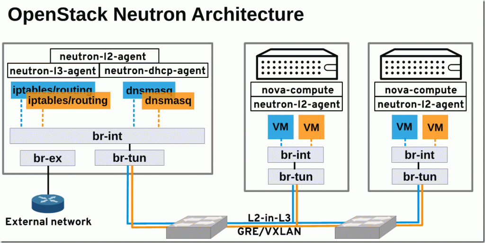
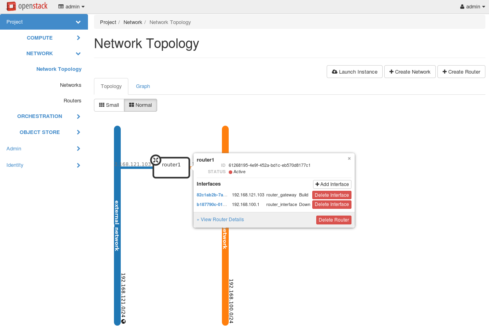
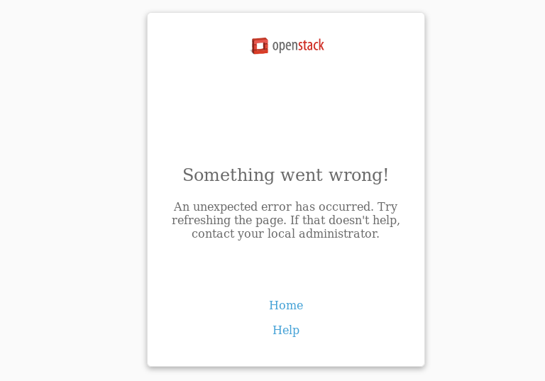

***************
Openstack Cloud
***************

::

    mkdir lab2
    cd lab2
    vi Vagrantfile

Vagrantfile

.. literalinclude:: lab2_vagrantfile

Terminal1::

    vagrant up --provider libvirt

    vagrant status
    Current machine states:

    controller                running (libvirt)
    compute                   running (libvirt)

    vagrant ssh controller
    //change to root
    sudo su -
    ssh-keygen -t rsa -b 4096 -C "openstack"
    ssh-copy-id compute
    ssh-copy-id controller

    //Test ssh
    ssh compute "hostname"
    exit
    ssh controller "hostname"
    exit

 สร้าง volume group ชื่อว่า ``cinder-volumes`` Terminal1::

    //prepare disk for volume group
    //change to root
    sudo su -
    fdisk -l

    fdisk /dev/vdb
    n
    p
    1
    enter
    enter
    w

    partprobe
    cat /proc/partitions

    pvcreate /dev/vdb1
    vgcreate cinder-volumes /dev/vdb1

ตั้งค่า Timeserver ให้แก่เครื่อง controller::

        $ sudo yum install chrony -y
        $ sudo vi  /etc/chrony.conf
        //เปลี่ยนแปลง time server
        server 1.th.pool.ntp.org iburst
        server 0.asia.pool.ntp.org iburst
        server 2.asia.pool.ntp.org iburst

        //อนุญาติให้เครื่องในวง 10.10.10.0/24 สามารถ syncได้
        allow 10.10.10.0/24

        $ sudo systemctl restart chronyd
        $ chronyc sources

        210 Number of sources = 3
        MS Name/IP address         Stratum Poll Reach LastRx Last sample
        ===============================================================================
        ^- ntp02.cpe.rmutt.ac.th         2   6     7     1    -16ms[  -11ms] +/-  225ms
        ^* time1.isu.net.sa              1   6     7     0  +5882us[  +11ms] +/-  140ms
        ^+ 202-65-114-202.jogja.citr     2   6     7     1    -13ms[-7965us] +/-   93ms

.. note:: ค่า Stratum มีค่าเท่ากับ 2

ตั้งค่า Timeserver แก่เครื่อง compute1 (สามารถเปิด อีก Terminal 2 มาทำงานได้ )::

        $ sudo yum install chrony -y
        $ sudo vi  /etc/chrony.conf
        //เปลี่ยนแปลง time server ให้ชื้ไปยัง server
        server 10.10.10.10 iburst

        sudo systemctl restart chronyd
        $ chronyc sources
        210 Number of sources = 1
        MS Name/IP address         Stratum Poll Reach LastRx Last sample
        ===============================================================================
        ^? controller.example.com     3   6     1     1  +6209us[+6209us] +/-   84ms

.. note:: ค่า Stratum มีค่าเท่ากับ 3 และ sync ไปยัง controller.example.com

เครื่อง controller ให้ run คำสั่ง packstack พร้อมกับ option เพื่อ ติดตั้ง openstack โดยคำสั่ง
packstack จะรับค่าoption และนำไปสร้าง file template ที่มีตัวแปรที่กำหนด หลังจากนั้นจะส่งต่อให้
puppet นำไปสร้างเป็น puppet module เพื่อติดตั้ง openstack ต่อไป

ติดตั้ง openstack Terminal1::

    //run packstck
    //packstack --install-hosts=CONTROLLER_ADDRESS,COMPUTE_ADDRESSES

    sudo su -
    cd /root/
    hostname
    controller

    packstack --install-hosts=10.10.10.10,10.10.10.11 \
    --nagios-install=n \
    --provision-demo=n \
    --os-neutron-ovs-bridge-mappings=extnet:br-ex,physnet1:br-eth2 \
    --os-neutron-ovs-bridge-interfaces=br-ex:eth0,br-eth2:eth2 \
    --os-neutron-ml2-type-drivers=vxlan,flat,local,vlan \
    --os-neutron-ml2-vlan-ranges=physnet1:1000:2000 \
    --os-heat-install=y --os-heat-cfn-install=y \
    --os-sahara-install=y --os-trove-install=y \
    --os-neutron-lbaas-install=y \
    --cinder-volumes-create=n \
    --keystone-admin-passwd=linux

ท่านสามารถเเปลี่ยน password ได้จาก บรรทัด keystone-admin-passwd=<password ที่ต้องการ>
::

    Applying 10.10.10.10_controller.pp
    10.10.10.10_controller.pp:                           [ DONE ]
    Applying 10.10.10.10_network.pp
    10.10.10.10_network.pp:                              [ DONE ]
    Applying 10.10.10.11_compute.pp
    10.10.10.11_compute.pp:                              [ DONE ]
    Applying Puppet manifests                            [ DONE ]
    Finalizing                                           [ DONE ]

    Additional information:
     * A new answerfile was created in: /root/packstack-answers-20161012-141203.txt
     * Time synchronization installation was skipped. Please note that unsynchronized time on server instances might be problem for some OpenStack components.
     * File /root/keystonerc_admin has been created on OpenStack client host 10.10.10.10. To use the command line tools you need to source the file.
     * To access the OpenStack Dashboard browse to http://10.10.10.10/dashboard .
    Please, find your login credentials stored in the keystonerc_admin in your home directory.
     * Because of the kernel update the host 10.10.10.11 requires reboot.
     * Because of the kernel update the host 10.10.10.10 requires reboot.
     * The installation log file is available at: /var/tmp/packstack/20161012-011346-Rr34Lj/openstack-setup.log
     * The generated manifests are available at: /var/tmp/packstack/20161012-011346-Rr34Lj/manifests
    [root@controller ~]#

.. note:: เมื่อติดตั้ง ประสบความสำเร็จ packstack จะรายงายผลออกมาที่สำคัญได้แก่

    ::

        * ชื่อของ answerfile ที่ใช้สำหรับการแก้ไขต่อไปในอนาคต /root/packstack-answers-20161012-141203.txt
        * ip address สำหรับการเข้าใช้งาน

.. warning::  หากมีความผิดพลาดแล้วจะต้อง run packstack ใหม่ให้ สั่งคำสั่ง จาก answerfil ที่สร้างขึ้น

    ::

        [root@controller ~]# ls
        packstack-answers-20161012-011347.txt
        [root@controller ~]# packstack --answer-file=packstack-answers-20161012-011347.txt

ให้เปิด terminal เพื่อใช้สำหรับติดตั้งบนเครื่อง host โดยจะทำการติดตั้ง openstack client  เพื่อเข้าไปใช้งาน

Terminal2::

      //install openstack client
      ## Install openstack client [on host]
      $ sudo dnf install python-{openstack,keystone,nova,neutron,glance,cinder,\
      swift,heat,ceilometer}client

      ## create working folder

      $ cd ~ && mkdir openstackrc && cd openstackrc

      ##create file ชื่อ admin_rc_v2 (เป็นชื่ออะไรก็ได)
      $ cat << RC > admin_rc_v2
      unset OS_SERVICE_TOKEN
      export OS_USERNAME=admin
      export OS_PASSWORD=linux
      export OS_AUTH_URL=http://10.10.10.10:5000/v2.0
      export PS1='[\u@\h \W(keystone_admin)]\$ '
      export OS_TENANT_NAME=admin
      export OS_REGION_NAME=RegionOne
      RC
      ## Test เรียกดู user
      $ source admin_rc_v2
      $ openstack user list

      +----------------------------------+------------+
      | ID                               | Name       |
      +----------------------------------+------------+
      | 5c08e42a280445e283a71d6e01735811 | admin      |
      | 08bc39d8bfaf40e5903dd96a0641ee9d | neutron    |
      | a7dfe90d96e345268d303f95cab83ef2 | heat       |
      | ab12686ca4b14868956d310f1aca1af8 | gnocchi    |
      | 38be373dfe674e089e02c88be07f92a2 | aodh       |
      | 036d2e3e3ed940dd84b0575d838621bc | nova       |
      | 302bbb18eeab418f83288690521dd1bf | glance     |
      | eb387675e73441a497f4549d59fa02f4 | trove      |
      | 14c2a2c213d64be499315b8897585924 | sahara     |
      | e44524eff3da4c57a8283caead1c63ea | ceilometer |
      | 830c925ee56045df8c7a226612f66d26 | cinder     |
      | 96f580c5af874165a54f28d71f3641ca | heat-cfn   |
      | 355e46c0f63b499aa2b7eb14f698f97e | swift      |
      +----------------------------------+------------+

      $ openstack project list
      +----------------------------------+----------+
      | ID                               | Name     |
      +----------------------------------+----------+
      | 297c9df6fa3c469cbb587248cf59cb4e | admin    |
      | 34c47a8e222543918153a2ed348f419d | services |
      +----------------------------------+----------+

      $ openstack role list
      +----------------------------------+------------------+
      | ID                               | Name             |
      +----------------------------------+------------------+
      | 3db26d6d909848aa8aefd886d9aa8f2a | SwiftOperator    |
      | 84bb64935d284a248791c4a3bac183ff | heat_stack_user  |
      | 88c6a2e7af25486487e61153554fde71 | admin            |
      | 9fe2ff9ee4384b1894a90878d3e92bab | _member_         |
      | b10f0d654b5c4d22bc2818c0c9d1012c | ResellerAdmin    |
      | d609a95d200f46bca2d893b421f12cff | heat_stack_owner |
      +----------------------------------+------------------+

เครื่อง host

Terminal2::

      $ cd ~/openstackrc
      $ wget http://download.cirros-cloud.net/0.3.4/cirros-0.3.4-x86_64-disk.img
      $ openstack image create "cirros" \
      --file cirros-0.3.4-x86_64-disk.img \
      --disk-format qcow2 --container-format bare \
      --public

      ผลลัพท์ที่ได้
      +------------------+------------------------------------------------------+
      | Field            | Value                                                |
      +------------------+------------------------------------------------------+
      | checksum         | ee1eca47dc88f4879d8a229cc70a07c6                     |
      | container_format | bare                                                 |
      | created_at       | 2016-10-12T05:25:56Z                                 |
      | disk_format      | qcow2                                                |
      | file             | /v2/images/eb971176-4804-4fc2-8266-a90b1341b8a6/file |
      | id               | eb971176-4804-4fc2-8266-a90b1341b8a6                 |
      | min_disk         | 0                                                    |
      | min_ram          | 0                                                    |
      | name             | cirros                                               |
      | owner            | 686e1f1af2ce4333931bd178c12c22c3                     |
      | protected        | False                                                |
      | schema           | /v2/schemas/image                                    |
      | size             | 13287936                                             |
      | status           | active                                               |
      | tags             |                                                      |
      | updated_at       | 2016-10-12T05:25:56Z                                 |
      | virtual_size     | None                                                 |
      | visibility       | public                                               |
      +------------------+------------------------------------------------------+

      แสดง รายการ image
      $ openstack image list
      +--------------------------------------+--------+--------+
      | ID                                   | Name   | Status |
      +--------------------------------------+--------+--------+
      | eb971176-4804-4fc2-8266-a90b1341b8a6 | cirros | active |
      +--------------------------------------+--------+--------+

      $ wget http://cloud.centos.org/centos/7/images/CentOS-7-x86_64-GenericCloud.qcow2
      $ openstack image create "centos-7-x86_64" \
      --file CentOS-7-x86_64-GenericCloud.qcow2 \
      --disk-format qcow2 --container-format bare \
      --public

Network Architecture
********************

Openvswitch device
******************
Terminal 1 บนเครื่อง controller ตรวจสอบ ด้วยคำสั่ง `ovs-vscht show`
::

      # ovs-vsctl show
      6a15cbb5-18ef-4e40-8a6a-339dc0fccb7b
          Manager "ptcp:6640:127.0.0.1"
              is_connected: true
          Bridge br-tun
              Controller "tcp:127.0.0.1:6633"
                  is_connected: true
              fail_mode: secure
              Port patch-int
                  Interface patch-int
                      type: patch
                      options: {peer=patch-tun}
              Port br-tun
                  Interface br-tun
                      type: internal
              Port "vxlan-0a0a0a0b"
                  Interface "vxlan-0a0a0a0b"
                      type: vxlan
                      options: {df_default="true", in_key=flow, local_ip="10.10.10.10", out_key=flow, remote_ip="10.10.10.11"}
          Bridge br-int
              Controller "tcp:127.0.0.1:6633"
                  is_connected: true
              fail_mode: secure
              Port "int-br-eth2"
                  Interface "int-br-eth2"
                      type: patch
                      options: {peer="phy-br-eth2"}
              Port int-br-ex
                  Interface int-br-ex
                      type: patch
                      options: {peer=phy-br-ex}
              Port patch-tun
                  Interface patch-tun
                      type: patch
                      options: {peer=patch-int}
              Port br-int
                  Interface br-int
                      type: internal
          Bridge br-ex
              Controller "tcp:127.0.0.1:6633"
                  is_connected: true
              fail_mode: secure
              Port "eth0"
                  Interface "eth0"
              Port phy-br-ex
                  Interface phy-br-ex
                      type: patch
                      options: {peer=int-br-ex}
              Port br-ex
                  Interface br-ex
                      type: internal
          Bridge "br-eth2"
              Controller "tcp:127.0.0.1:6633"
                  is_connected: true
              fail_mode: secure
              Port "eth2"
                  Interface "eth2"
              Port "br-eth2"
                  Interface "br-eth2"
                      type: internal
              Port "phy-br-eth2"
                  Interface "phy-br-eth2"
                      type: patch
                      options: {peer="int-br-eth2"}
          ovs_version: "2.5.0"

ภาพแสดง อุปกรณ์ ที่เป็น virtual devices ที่สร้างโดย openstack
Compute node

.. image:: images/under-the-hood-scenario-1-ovs-compute.png

Controller/Network node

.. image:: images/under-the-hood-scenario-1-ovs-network.png

สร้าง virtual network
********************

สร้าง flat network ชื่อ extnet  [เนื่องจาก --os-neutron-ovs-bridge-mappings=extnet:br-ex]
::

      $ neutron net-create external_network --provider:network_type flat --provider:physical_network extnet  --router:external
      Created a new network:
      +---------------------------+--------------------------------------+
      | Field                     | Value                                |
      +---------------------------+--------------------------------------+
      | admin_state_up            | True                                 |
      | availability_zone_hints   |                                      |
      | availability_zones        |                                      |
      | created_at                | 2016-10-12T05:33:58Z                 |
      | description               |                                      |
      | id                        | b44cddbc-e544-434b-a96c-0ab95e741b29 |
      | ipv4_address_scope        |                                      |
      | ipv6_address_scope        |                                      |
      | is_default                | False                                |
      | mtu                       | 1500                                 |
      | name                      | external_network                     |
      | project_id                | 686e1f1af2ce4333931bd178c12c22c3     |
      | provider:network_type     | flat                                 |
      | provider:physical_network | extnet                               |
      | provider:segmentation_id  |                                      |
      | revision_number           | 2                                    |
      | router:external           | True                                 |
      | shared                    | False                                |
      | status                    | ACTIVE                               |
      | subnets                   |                                      |
      | tags                      |                                      |
      | tenant_id                 | 686e1f1af2ce4333931bd178c12c22c3     |
      | updated_at                | 2016-10-12T05:33:58Z                 |
      +---------------------------+--------------------------------------+

      $ neutron subnet-create --name public_subnet --enable_dhcp=False --allocation-pool=start=192.168.121.100,end=192.168.121.200 \
      --gateway=192.168.121.1 external_network 192.168.121.0/24

      Created a new subnet:
      +-------------------+--------------------------------------------------------+
      | Field             | Value                                                  |
      +-------------------+--------------------------------------------------------+
      | allocation_pools  | {"start": "192.168.121.100", "end": "192.168.121.200"} |
      | cidr              | 192.168.121.0/24                                       |
      | created_at        | 2016-10-12T05:37:09Z                                   |
      | description       |                                                        |
      | dns_nameservers   |                                                        |
      | enable_dhcp       | False                                                  |
      | gateway_ip        | 192.168.121.1                                          |
      | host_routes       |                                                        |
      | id                | a34c2cde-e5ec-42b5-8de4-232b425fb861                   |
      | ip_version        | 4                                                      |
      | ipv6_address_mode |                                                        |
      | ipv6_ra_mode      |                                                        |
      | name              | public_subnet                                          |
      | network_id        | b44cddbc-e544-434b-a96c-0ab95e741b29                   |
      | project_id        | 686e1f1af2ce4333931bd178c12c22c3                       |
      | revision_number   | 2                                                      |
      | service_types     |                                                        |
      | subnetpool_id     |                                                        |
      | tenant_id         | 686e1f1af2ce4333931bd178c12c22c3                       |
      | updated_at        | 2016-10-12T05:37:09Z                                   |
      +-------------------+--------------------------------------------------------+

สร้าง router และผู้กับ exteranl_network ทีสร้างไว้ก่อนแล้ว
::

      $ neutron router-create router1
      Created a new router:
      +-------------------------+--------------------------------------+
      | Field                   | Value                                |
      +-------------------------+--------------------------------------+
      | admin_state_up          | True                                 |
      | availability_zone_hints |                                      |
      | availability_zones      |                                      |
      | created_at              | 2016-10-12T05:37:58Z                 |
      | description             |                                      |
      | distributed             | False                                |
      | external_gateway_info   |                                      |
      | flavor_id               |                                      |
      | ha                      | False                                |
      | id                      | 61268195-4e9f-452a-bd1c-eb570d8177c1 |
      | name                    | router1                              |
      | project_id              | 686e1f1af2ce4333931bd178c12c22c3     |
      | revision_number         | 2                                    |
      | routes                  |                                      |
      | status                  | ACTIVE                               |
      | tenant_id               | 686e1f1af2ce4333931bd178c12c22c3     |
      | updated_at              | 2016-10-12T05:37:58Z                 |
      +-------------------------+--------------------------------------+

      $ neutron router-gateway-set router1 external_network
      Set gateway for router router1

สร้าง private network และผูก interface กับ router1
::

      $ neutron net-create private_network
      Created a new network:
      +---------------------------+--------------------------------------+
      | Field                     | Value                                |
      +---------------------------+--------------------------------------+
      | admin_state_up            | True                                 |
      | availability_zone_hints   |                                      |
      | availability_zones        |                                      |
      | created_at                | 2016-10-12T05:41:12Z                 |
      | description               |                                      |
      | id                        | edaa3879-691e-4cef-89a4-eba6f866129e |
      | ipv4_address_scope        |                                      |
      | ipv6_address_scope        |                                      |
      | mtu                       | 1450                                 |
      | name                      | private_network                      |
      | project_id                | 686e1f1af2ce4333931bd178c12c22c3     |
      | provider:network_type     | vxlan                                |
      | provider:physical_network |                                      |
      | provider:segmentation_id  | 85                                   |
      | revision_number           | 2                                    |
      | router:external           | False                                |
      | shared                    | False                                |
      | status                    | ACTIVE                               |
      | subnets                   |                                      |
      | tags                      |                                      |
      | tenant_id                 | 686e1f1af2ce4333931bd178c12c22c3     |
      | updated_at                | 2016-10-12T05:41:12Z                 |
      +---------------------------+--------------------------------------+

      $ neutron subnet-create --name private_subnet private_network 192.168.100.0/24

      Created a new subnet:
      +-------------------+------------------------------------------------------+
      | Field             | Value                                                |
      +-------------------+------------------------------------------------------+
      | allocation_pools  | {"start": "192.168.100.2", "end": "192.168.100.254"} |
      | cidr              | 192.168.100.0/24                                     |
      | created_at        | 2016-10-12T05:41:36Z                                 |
      | description       |                                                      |
      | dns_nameservers   |                                                      |
      | enable_dhcp       | True                                                 |
      | gateway_ip        | 192.168.100.1                                        |
      | host_routes       |                                                      |
      | id                | fe006934-5bdc-4643-aba7-4e4e59a587a6                 |
      | ip_version        | 4                                                    |
      | ipv6_address_mode |                                                      |
      | ipv6_ra_mode      |                                                      |
      | name              | private_subnet                                       |
      | network_id        | edaa3879-691e-4cef-89a4-eba6f866129e                 |
      | project_id        | 686e1f1af2ce4333931bd178c12c22c3                     |
      | revision_number   | 2                                                    |
      | service_types     |                                                      |
      | subnetpool_id     |                                                      |
      | tenant_id         | 686e1f1af2ce4333931bd178c12c22c3                     |
      | updated_at        | 2016-10-12T05:41:36Z                                 |
      +-------------------+------------------------------------------------------+

      $ neutron router-interface-add router1 private_subnet
      (ผลที่ได้ทำให้ external และ private subnet เชื่อมหากัน)
      Added interface b187790c-0192-4819-8881-c82553260485 to router router1.

ผลที่ได้

หากเกิด Basic Error ดังรูปแก้โดย restart httpd

::

      systemctl restart httpd
