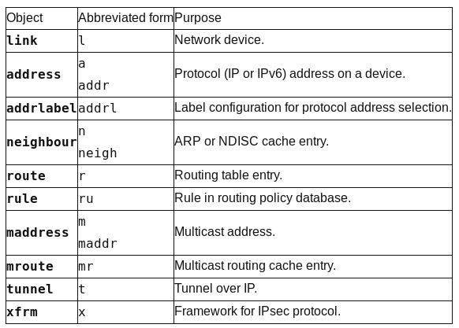

===========================
Network Virtualization Device
===========================

Network Bridge
==============

Getting Setup
*************

Introduction
------------
เราสามารถสร้าง network bridge เพื่อทำหน้าที่เป็น virtual switch ใน linux เพื่อให้รองรับการสร้าง vm guest โดย   vm จะเชื่อมต่ออยู่กับ Network Adapter ที่สร้างที่อยู่บน bridge เดียวกันจะสามารถสื่อสารระหว่างกันได้  เหมือนกับการต่ออยู่กับ physical switch.
ก่อนหน้านี้เราใช้คำสั่ง brctl จาก package ชื่อ bridge-utils ในการสร้าง bridge และทำการเชื่อม bridgeกับ interface ปัจจุบัน สามารถใช้คำสั่ง ip ที่อยู่ใน package ชื่อ iproute3

IP Command
----------
คำสั่ง ip เป็นคำสั่งที่อยู่ใน package  iproute3 ส่วนคำสั่ง ifconfig จะอยู่ใน package nettools

Syntax
::

	ip OBJECT COMMAND
	ip [options] OBJECT COMMAND
	ip OBJECT help

Object สามารถ แทนค่าได้ตามตารางด้านล่าง ทั้งแบบเต็มหรือแบบย่อ

::

    cd ~
    mkdir bridge
    cd bridge
    vagrant init centos/7
    vagrant up
    vagrant ssh
    sudo su -
::

	su -
    ip addr
    ip addr show eth0
    ip route show
    traceroute google.com

	//list interface
	ip link

	#เพิ่ม ip ให้ interface
	# syntax: ip a add {ip_addr/mask} dev {interface}
	// เลือก ip ที่อยู่ใน subnet 192.168.121.0/24

	ip a add 192.168.121.20/24 dev eth0
	ip a s eth0

	#เปลี่ยนแปลงค่า MTU
	ip link set mtu 9000 dev eth0
	ip a s eth0

	#เปลี่ยน route ให้ไปออกที่ eth2 และมี next ip 192.168.1.100
	ip route add default via 192.168.1.100 dev eth2
	ip route
	#ลบ ip route
	ip route del default via 192.168.1.100 dev eth2

สร้าง bridge (type bridge)
::

	ip link

	ip link add br0 type bridge

	ip link

	#เพิ่ม physical network interface ไปยัง bridge  ที่สร้างมา
	ip link set eth0 master br0

	#เพิ่มip
	ip addr add 192.168.1.100/24 dev br0
	#ลบip
	ip addr del 192.168.1.100/24 dev br0

Linux bridge
------------
เพื่อเชื่อมเครื่องคอมพิวเตอร์ เข้าหากัน โดยการใช้ Mac Address (Layer 2) แทนที่จะเป็นการเชื่อมกันระหว่าง ip (Layer3) โดยปรกติ linux network จะป้องกันไม่ให้ส่ง traffice จาก interface หนึ่งไปอีก interface หนึ่ง เราอาจ ใช้  ip routing ให้ทำหน้าที่ในการส่งข้อมูล ด้วยการกำหนดค่า ใน sysctrl เป็นการทำ ip forward

::

	cat /proc/sys/net/ipv4/ip_forward
	vi /etc/sysctrl.conf
	net.ipv4.ip_forward = 1
	sysctl -p /etc/sysctl.conf
	service network restart
	cat /proc/sys/net/ipv4/ip_forward

Linux kernel ยังสามารถ bridge ระหว่าง interface เพื่อส่งผ่าน ethernet frame การสร้าง linux bridge ได้หลายหลายวิธี  โดยมี kernel module
::

	lsmod | grep bridge
	bridge                126976  1 ebtable_broute
	stp                    16384  2 garp,bridge
	llc                    16384  3 stp,garp,bridge

* สร้างด้วย iproute2 คำสั่ง ip
* สร้างด้วย bridge-utils คำสั่ง brctl

iproute2
--------
::

	#bridge ชือ br0
	ip link add br0 type bridge
	ip link
	ip link set dev br0 up

	#เพิ่ม interface (eth0) ไปยัง  bridge ต้องอยู่สถานะ up
	ip addr flush eth0
	ip link set eth0 up
	ip link set eth0 master br0
	#ดูสถานะ
	bridge link
	#ถอด  eth0 จาก br0
	ip link set eth0 nomaster
	#ลบ bridge
	ip link delete br0 type bridge

bridge-utils
------------
::

	#bridge ชือ br0
	brctl addbr br0
	brctl show
	ip link set dev br0 up
	ip addr flush eth0
	brctl addif br0 eth0
	brctl show
	brctl showmacs br0
	#mac ของ bridge คือ mac ของ eth0
	#กำหนด ip
	ip addr add 10.0.0.10/24 dev br0
	ip addr show br0
	brctl showmacs br0

	#ลบbridge ต้อง down ก่อน
	ip link set dev br0 down
	brctl delbr br0

ที่ทำมาทั้งหมด จะหายไปเมื่อมีการ reboot เครื่อง เนื่องจากเป็นเพียง  session เท่านั้น เพื่อต้องการให้การเปลี่ยนแปลง สามารถเป็นแบบ ถาวร จะต้องทำการสร้าง  config file ให้แก่ br0 ที่  ``/etc/sysconfig/network-scripts/ifcfg-br0`` และทำการแก้ไข  ``/etc/sysconfig/network-scripts/ifcfg-eth0``

/etc/sysconfig/network-scripts/ifcfg-br0::

	DEVICE=br0
	TYPE=Bridge
	IPADDR=10.0.0.10
	PREFIX=24
	ONBOOT=yes

/etc/sysconfig/network-scripts/ifcfg-eth0::

	DEVICE=eth0
	BRIDGE=br0
	TYPE=Ethernet
	ONBOOT=yes
